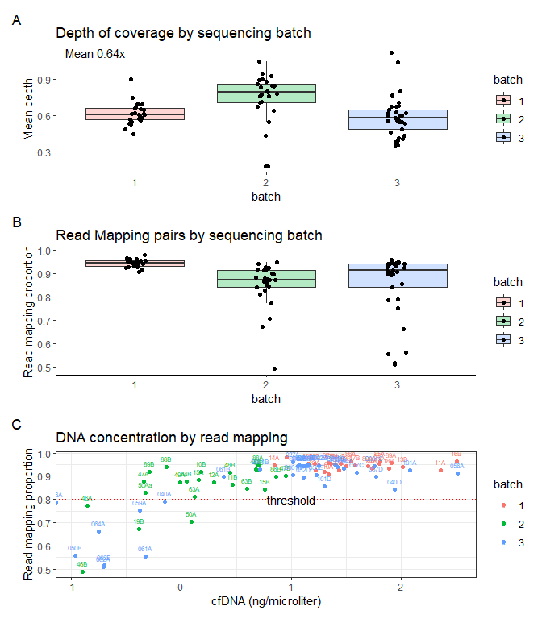

```r
install.packages("vroom")
install.packages("tidyverse")
install.packages("ggplot2")
install.packages("stringr")
install.packages("patchwork")
```


```r
knitr::opts_chunk$set(echo = TRUE)

library(vroom)
library(ggplot2)
library(tidyverse)
library(patchwork)
```


# Import and manipulate

The preprocessing results are merged together to compare sequencing information for each batch.


```r
#input of b2 annotation
b1_preproc <- vroom("inputs/Batch1_preprocessing_stats_2023-06-27_11-43-51.csv")
```

```
## Rows: 25 Columns: 6
## ── Column specification ────────────────────────────────────────────────────────
## Delimiter: ","
## chr (1): sample_id
## dbl (5): before_filtering, after_filtering, Mapped_read_pairs, meandepth, co...
## 
## ℹ Use `spec()` to retrieve the full column specification for this data.
## ℹ Specify the column types or set `show_col_types = FALSE` to quiet this message.
```

```r
b2_preproc <- vroom("inputs/Batch2_preprocessing_stats_2023-06-27_11-48-42.csv")
```

```
## Rows: 25 Columns: 6
## ── Column specification ────────────────────────────────────────────────────────
## Delimiter: ","
## chr (1): sample_id
## dbl (5): before_filtering, after_filtering, Mapped_read_pairs, meandepth, co...
## 
## ℹ Use `spec()` to retrieve the full column specification for this data.
## ℹ Specify the column types or set `show_col_types = FALSE` to quiet this message.
```

```r
b3_preproc <- vroom("inputs/Batch3_preprocessing_stats_2023-06-27_11-53-18.csv")
```

```
## Rows: 33 Columns: 6
## ── Column specification ────────────────────────────────────────────────────────
## Delimiter: ","
## chr (1): sample_id
## dbl (5): before_filtering, after_filtering, Mapped_read_pairs, meandepth, co...
## 
## ℹ Use `spec()` to retrieve the full column specification for this data.
## ℹ Specify the column types or set `show_col_types = FALSE` to quiet this message.
```

```r
sample_data <- vroom("inputs/sample_data.csv")
```

```
## Rows: 83 Columns: 16
## ── Column specification ────────────────────────────────────────────────────────
## Delimiter: ","
## chr  (3): Sample, ExtractionDate, ExtractionOrder
## dbl (13): Batch, DaysTillQubit, QubitPreClean, TapestationPostClean, FinalLi...
## 
## ℹ Use `spec()` to retrieve the full column specification for this data.
## ℹ Specify the column types or set `show_col_types = FALSE` to quiet this message.
```

```r
dna_conc <- sample_data %>% select(Sample ,QubitPreClean, TapestationPostClean, FinalLibraryConc, TotalDNAForLibPrep)

dna_conc
```

```
## # A tibble: 83 × 5
##    Sample QubitPreClean TapestationPostClean FinalLibraryConc TotalDNAForLibPrep
##    <chr>          <dbl>                <dbl>            <dbl>              <dbl>
##  1 10A             3.32                1.22              47.5              22.0 
##  2 11A             4.74               12.7               55               229.  
##  3 12B             0.82                0.505             27.3               9.09
##  4 13B             2.79                5.71              47.8             103.  
##  5 14A             0.6                 0.388             17.9               6.98
##  6 16B            14.7                17.7               50               319.  
##  7 17A             2.09                1.52              27                27.4 
##  8 17B             1.86                2.12              36                38.2 
##  9 18A             2.09                1.38              40.4              24.8 
## 10 18B             2.1                 4.28              41.9              77.0 
## # … with 73 more rows
```

```r
# add in batch information as a factor
b1_preproc$batch <- as.factor(1)
b2_preproc$batch <- as.factor(2)
b3_preproc$batch <- as.factor(3)

#merge 
preproc_all <- bind_rows(b1_preproc, b2_preproc, b3_preproc)

preproc_all_dna <- preproc_all %>% inner_join(dna_conc, by = c("sample_id" = "Sample"))
```


```r
# A - read mapping by batch 

read_map.p <-  ggplot(preproc_all, aes(y = Mapped_read_pairs, x = batch, fill = batch)) +
  geom_boxplot(alpha = 0.3, outlier.shape=NA) +
  geom_point(position=position_jitterdodge()) + 
  theme_classic() +
  ggtitle("Read Mapping pairs by sequencing batch") +
  ylab("Read mapping proportion")


# B - Depth of coverage 

#calculate mean depth to annotate graph
mean_depth_value <- mean(preproc_all$meandepth)

# plot depth per read
depth.p <- ggplot(preproc_all, aes(y = meandepth, x = batch, fill = batch)) +
  geom_boxplot(alpha = 0.3, outlier.shape=NA) +
  geom_point(position=position_jitterdodge()) + 
  theme_classic() +
  ggtitle("Depth of coverage by sequencing batch") +
  ylab("Mean depth") + annotate("text", x = 0.7, y = 1, label = sprintf("Mean %.2fx", mean_depth_value),
                                color = "black", size = 4, vjust = -1)


# C - read mapping by DNA concentration

dna_conc.p <- ggplot(preproc_all_dna, aes(y = Mapped_read_pairs, x = log10(TotalDNAForLibPrep), col = batch)) +
  geom_point() +
  geom_text(aes(label = sample_id), vjust = -1, size = 2, check_overlap = FALSE) +
  ggtitle("DNA concentration by read mapping") +
  theme_bw() +  
  geom_hline(yintercept=0.8, linetype='dotted', col = 'red') +
  annotate("text", x = 1, y = 0.78, label = "threshold", vjust = -0) +
  ylab("Read mapping proportion") +
  xlab("cfDNA (ng/microliter)")
```


```r
### merge all graphs using patchwork

(depth.p / read_map.p / dna_conc.p)  + plot_annotation(tag_levels = "A")
```

```
## Warning: Removed 2 rows containing missing values (`geom_point()`).
```

```
## Warning: Removed 2 rows containing missing values (`geom_text()`).
```

<!-- -->

```r
ggsave("final_figures/Figure_2_ctDNA_preprocessing.pdf", height = 8 , width = 6 )
```

```
## Warning: Removed 2 rows containing missing values (`geom_point()`).
## Removed 2 rows containing missing values (`geom_text()`).
```


# sessionInfo

```r
installed.packages()[names(sessionInfo()$otherPkgs), "Version"]
```

```
##    patchwork      forcats      stringr        dplyr        purrr        readr 
##      "1.1.2"      "0.5.2"      "1.4.1"     "1.0.10"      "0.3.5"      "2.1.3" 
##        tidyr       tibble    tidyverse      ggplot2        vroom 
##      "1.2.1"      "3.1.8"      "1.3.2"      "3.4.0" "1.6.0.9000"
```
