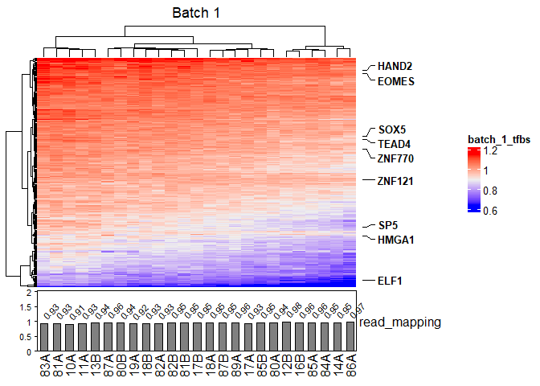
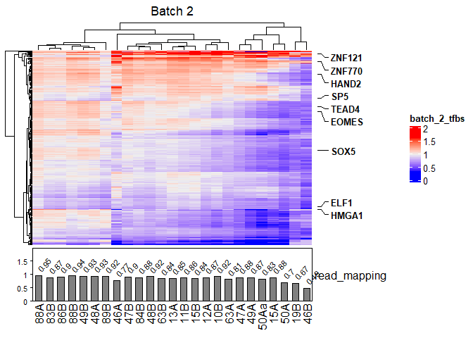
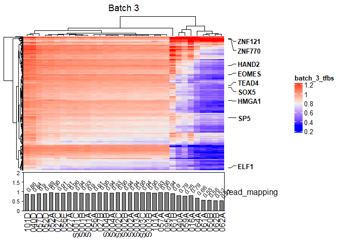

This R markdown provides central coverage heatmaps for all of the samples. A separate markdwon is available for the high quality samples. 

# Install


```r
install.packages("vroom")
install.packages("tidyverse")
install.packages("ggplot2")
install.packages("stringr")
install.packages("ComplexHeatmap")
install.packages("circlize")
```

## Load


```r
knitr::opts_chunk$set(echo = TRUE)

library("vroom")
library("tidyverse")
library("ggplot2")
library("stringr")
library("ComplexHeatmap")
library(circlize)
```

# Importing griffin coverage data

The griffin results for each sample have been merged in python, further data manipulation is required for further analysis.


```r
### Data import and manipulation. ###

#sets wd to location of rmd file R studio only not console
#setwd(dirname(rstudioapi::getActiveDocumentContext()$path))

# import corrected coverage for all samples
b1_cov = vroom("inputs/Batch1_Griffin GC_corrected.coverage_2023-06-06_11-47-59.csv")
```

```
## New names:
## Rows: 6750 Columns: 147
## ── Column specification
## ──────────────────────────────────────────────────────── Delimiter: "," chr
## (4): correction, site_name, sample, sample_id dbl (140): ...1, -990, -975,
## -960, -945, -930, -915, -900, -885, -870, -855,... lgl (3):
## exclude_zero_mappability, smoothing, CNA_normalization
## ℹ Use `spec()` to retrieve the full column specification for this data. ℹ
## Specify the column types or set `show_col_types = FALSE` to quiet this message.
## • `` -> `...1`
```

```r
b2_cov = vroom("inputs/Batch2_Griffin GC_corrected.coverage_2023-05-28_09-32-09.csv")
```

```
## New names:
## Rows: 6750 Columns: 147
## ── Column specification
## ──────────────────────────────────────────────────────── Delimiter: "," chr
## (4): correction, site_name, sample, sample_id dbl (140): ...1, -990, -975,
## -960, -945, -930, -915, -900, -885, -870, -855,... lgl (3):
## exclude_zero_mappability, smoothing, CNA_normalization
## ℹ Use `spec()` to retrieve the full column specification for this data. ℹ
## Specify the column types or set `show_col_types = FALSE` to quiet this message.
## • `` -> `...1`
```

```r
b3_cov = vroom("inputs/Batch3_Griffin GC_corrected.coverage_2023-06-06_11-49-52.csv")
```

```
## New names:
## Rows: 8910 Columns: 147
## ── Column specification
## ──────────────────────────────────────────────────────── Delimiter: "," chr
## (4): correction, site_name, sample, sample_id dbl (140): ...1, -990, -975,
## -960, -945, -930, -915, -900, -885, -870, -855,... lgl (3):
## exclude_zero_mappability, smoothing, CNA_normalization
## ℹ Use `spec()` to retrieve the full column specification for this data. ℹ
## Specify the column types or set `show_col_types = FALSE` to quiet this message.
## • `` -> `...1`
```

```r
#input of pre-processing data for annotations
b1_preproc <- vroom("inputs/Batch1_preprocessing_stats_2023-06-27_11-43-51.csv")
```

```
## Rows: 25 Columns: 6
## ── Column specification ────────────────────────────────────────────────────────
## Delimiter: ","
## chr (1): sample_id
## dbl (5): before_filtering, after_filtering, Mapped_read_pairs, meandepth, co...
## 
## ℹ Use `spec()` to retrieve the full column specification for this data.
## ℹ Specify the column types or set `show_col_types = FALSE` to quiet this message.
```

```r
b2_preproc <- vroom("inputs/Batch2_preprocessing_stats_2023-06-27_11-48-42.csv")
```

```
## Rows: 25 Columns: 6
## ── Column specification ────────────────────────────────────────────────────────
## Delimiter: ","
## chr (1): sample_id
## dbl (5): before_filtering, after_filtering, Mapped_read_pairs, meandepth, co...
## 
## ℹ Use `spec()` to retrieve the full column specification for this data.
## ℹ Specify the column types or set `show_col_types = FALSE` to quiet this message.
```

```r
b3_preproc <- vroom("inputs/Batch3_preprocessing_stats_2023-06-27_11-53-18.csv")
```

```
## Rows: 33 Columns: 6
## ── Column specification ────────────────────────────────────────────────────────
## Delimiter: ","
## chr (1): sample_id
## dbl (5): before_filtering, after_filtering, Mapped_read_pairs, meandepth, co...
## 
## ℹ Use `spec()` to retrieve the full column specification for this data.
## ℹ Specify the column types or set `show_col_types = FALSE` to quiet this message.
```

```r
# tidy up TFs naming
b1_cov$site_name <- str_remove(b1_cov$site_name, "\\..*")
b2_cov$site_name <- str_remove(b2_cov$site_name, "\\..*")
b3_cov$site_name <- str_remove(b3_cov$site_name, "\\..*")


# add in batch information as a factor
b1_cov$batch <- as.factor(1)
b2_cov$batch <- as.factor(2)
b3_cov$batch <- as.factor(3)


#could potential merge batch 1-3 into 1 dataframe now. 

#create a table of samples
b1_samples <- b1_cov %>% distinct(sample_id) %>% arrange(sample_id)
b2_samples <- b2_cov %>% distinct(sample_id) %>% arrange(sample_id)
b3_samples <- b3_cov %>% distinct(sample_id) %>% arrange(sample_id)


# create a list of all sites - same for all three batches
sites <-  b2_cov %>%  distinct(site_name) %>% arrange(site_name)

# glimpse(b3_cov)
```

## Data Manipultation

There are a large amount of numerical columns that need selecting and transposing.


```r
# update sample preprocessing stats with incorrect naming

b1_preproc <- b1_preproc %>% 
  mutate(sample_id = ifelse(sample_id == "19", "19A", sample_id))

#update coverage with correct naming.
b1_cov <- b1_cov %>% 
  mutate(sample_id = ifelse(sample_id == "19", "19A", sample_id))


# Create the sequence of columns for selection
plot_columns <- seq(-990, 975, 15)

# Convert the columns to string format
str_plot_columns <- as.character(plot_columns)

# transpose and pivot all three batches

b1_cov_T <- b1_cov %>% 
  select(sample_id, site_name, batch, all_of(str_plot_columns)) %>% 
  tidyr::pivot_longer(cols = str_plot_columns, names_to = "distance", values_to = "coverage") %>% 
  mutate(distance = as.numeric(distance))
```

```
## Warning: Using an external vector in selections was deprecated in tidyselect 1.1.0.
## ℹ Please use `all_of()` or `any_of()` instead.
##   # Was:
##   data %>% select(str_plot_columns)
## 
##   # Now:
##   data %>% select(all_of(str_plot_columns))
## 
## See <https://tidyselect.r-lib.org/reference/faq-external-vector.html>.
```

```r
b2_cov_T <- b2_cov %>% 
  select(sample_id, site_name, batch, all_of(str_plot_columns)) %>% 
  tidyr::pivot_longer(cols = str_plot_columns, names_to = "distance", values_to = "coverage") %>% 
  mutate(distance = as.numeric(distance))

b3_cov_T <- b3_cov %>% 
  select(sample_id, site_name, batch, all_of(str_plot_columns)) %>% 
  tidyr::pivot_longer(cols = str_plot_columns, names_to = "distance", values_to = "coverage") %>% 
  mutate(distance = as.numeric(distance))

glimpse(b1_cov_T)
```

```
## Rows: 891,000
## Columns: 5
## $ sample_id <chr> "10A", "10A", "10A", "10A", "10A", "10A", "10A", "10A", "10A…
## $ site_name <chr> "SOX5", "SOX5", "SOX5", "SOX5", "SOX5", "SOX5", "SOX5", "SOX…
## $ batch     <fct> 1, 1, 1, 1, 1, 1, 1, 1, 1, 1, 1, 1, 1, 1, 1, 1, 1, 1, 1, 1, …
## $ distance  <dbl> -990, -975, -960, -945, -930, -915, -900, -885, -870, -855, …
## $ coverage  <dbl> 0.97801, 0.97215, 0.95484, 0.95544, 0.96238, 0.97940, 1.0007…
```

```r
glimpse(b2_cov_T)
```

```
## Rows: 891,000
## Columns: 5
## $ sample_id <chr> "10B", "10B", "10B", "10B", "10B", "10B", "10B", "10B", "10B…
## $ site_name <chr> "SOX5", "SOX5", "SOX5", "SOX5", "SOX5", "SOX5", "SOX5", "SOX…
## $ batch     <fct> 2, 2, 2, 2, 2, 2, 2, 2, 2, 2, 2, 2, 2, 2, 2, 2, 2, 2, 2, 2, …
## $ distance  <dbl> -990, -975, -960, -945, -930, -915, -900, -885, -870, -855, …
## $ coverage  <dbl> 0.95939, 0.94878, 0.93026, 0.93794, 0.95738, 0.99191, 1.0192…
```

```r
glimpse(b3_cov_T)
```

```
## Rows: 1,176,120
## Columns: 5
## $ sample_id <chr> "061A", "061A", "061A", "061A", "061A", "061A", "061A", "061…
## $ site_name <chr> "SOX5", "SOX5", "SOX5", "SOX5", "SOX5", "SOX5", "SOX5", "SOX…
## $ batch     <fct> 3, 3, 3, 3, 3, 3, 3, 3, 3, 3, 3, 3, 3, 3, 3, 3, 3, 3, 3, 3, …
## $ distance  <dbl> -990, -975, -960, -945, -930, -915, -900, -885, -870, -855, …
## $ coverage  <dbl> 0.94109, 0.93995, 0.92253, 0.92361, 0.92964, 0.91955, 0.9348…
```


# Complex Heatmaps
 
Multivariate visualisations are required between patient samples, TFs and central coverage.
 
 
## A comparison across the 270 griffin sites.

This analysis visualises griffin expression across all the griffin transcription factor binding sites


```r
#create annotation data frames to check order
b1_ann <- b1_preproc %>% select(sample_id, Mapped_read_pairs)
b2_ann <- b2_preproc %>% select(sample_id, Mapped_read_pairs)
b3_ann <- b3_preproc %>% select(sample_id, Mapped_read_pairs)


#create annotations for each batch
b1_ha_bot = HeatmapAnnotation(read_mapping = anno_barplot(round(b1_ann$Mapped_read_pairs,2)
                                                          ,add_numbers = TRUE)
                              ,height = unit(2, "cm"))


b2_ha_bot = HeatmapAnnotation(read_mapping = anno_barplot(round(b2_ann$Mapped_read_pairs,2)
                                                          ,add_numbers = TRUE)
                              ,height = unit(2, "cm"))

b3_ha_bot = HeatmapAnnotation(read_mapping = anno_barplot(round(b3_ann$Mapped_read_pairs,2)
                                                          ,add_numbers = TRUE)
                              ,height = unit(2, "cm"))

#batch 1 - matrix creation

b1_mat <- 
  b1_cov %>% 
  select(site_name, sample_id, central_coverage) %>% 
  arrange(sample_id) %>% 
  pivot_wider(names_from = sample_id, values_from = central_coverage) %>% 
  column_to_rownames(var = "site_name") %>% 
  as.matrix()


# batch 2 - matrix creation 
b2_mat <- 
  b2_cov %>% 
  select(site_name, sample_id, central_coverage) %>% 
  arrange(sample_id) %>% 
  pivot_wider(names_from = sample_id, values_from = central_coverage) %>% 
  column_to_rownames(var = "site_name") %>% 
  as.matrix()

# batch 3 - matrix creation

b3_mat <- 
  b3_cov %>% 
  select(site_name, sample_id, central_coverage) %>% 
  arrange(sample_id) %>% 
  pivot_wider(names_from = sample_id, values_from = central_coverage) %>% 
  column_to_rownames(var = "site_name") %>% 
  as.matrix()
```


```r
#create colour mapping
col_fun = colorRamp2(c(0.4, 0.8, 1.2), c("blue", "white", "red"))
col_fun(seq(-3, 3))
```

```
## [1] "#0000FFFF" "#0000FFFF" "#0000FFFF" "#0000FFFF" "#FF9E81FF" "#FF0000FF"
## [7] "#FF0000FF"
```

```r
ht_b1_all = Heatmap(b1_mat
                #, col = col_fun
                , name = "batch_1_tfbs"
                #, clustering_distance_rows = "pearson"
                , bottom_annotation = b1_ha_bot
                , column_title = "Batch 1")


ht_b2_all = Heatmap(b2_mat
                #, col = col_fun
                #, show_heatmap_legend = FALSE
                , name = "batch_2_tfbs"
                #, clustering_distance_rows = "pearson"
                , bottom_annotation = b2_ha_bot
                , column_title = "Batch 2")
```

```
## The automatically generated colors map from the 1^st and 99^th of the
## values in the matrix. There are outliers in the matrix whose patterns
## might be hidden by this color mapping. You can manually set the color
## to `col` argument.
## 
## Use `suppressMessages()` to turn off this message.
```

```r
ht_b3_all = Heatmap(b3_mat
                #, col = col_fun
                #, show_heatmap_legend = FALSE
                , name = "batch_3_tfbs"
                #,clustering_distance_rows = "pearson"
                , bottom_annotation = b3_ha_bot
                , column_title = "Batch 3")
```

```
## The automatically generated colors map from the 1^st and 99^th of the
## values in the matrix. There are outliers in the matrix whose patterns
## might be hidden by this color mapping. You can manually set the color
## to `col` argument.
## 
## Use `suppressMessages()` to turn off this message.
```

```r
ht_list_all = ht_b1_all + ht_b2_all + ht_b3_all


genelabels <- rowAnnotation(
  Genes = anno_mark(
    at = seq(1, nrow(b1_mat), 30),
    labels = rownames(b1_mat)[seq(1, nrow(b1_mat), 30)],
    labels_gp = gpar(fontsize = 10, fontface = 'bold'),
    padding = 0.75),
  width = unit(2.0, 'cm') +
    
    max_text_width(
      rownames(b1_mat)[seq(1, nrow(b1_mat), 30)],
      gp = gpar(fontsize = 10,  fontface = 'bold')))
```

Figure 3


```r
draw(ht_list_all[,c("batch_1_tfbs")] + genelabels)
```

<!-- -->

```r
draw(ht_list_all[,c("batch_2_tfbs")] + genelabels)
```

<!-- -->

```r
draw(ht_list_all[,c("batch_3_tfbs")] + genelabels)
```

<!-- -->


```r
pdf(file = "final_figures/Figure_3-batch1_central_coverage.pdf",width = 8, height = 4) # height and width in inches
draw(ht_list_all[,c("batch_1_tfbs")] + genelabels)
# Step 3: Run dev.off() to create the file!
dev.off()
```

```
## png 
##   2
```

```r
pdf(file = "final_figures/Figure_3-batch2_central_coverage.pdf",width = 8, height = 4)
draw(ht_list_all[,c("batch_2_tfbs")] + genelabels)
dev.off()
```

```
## png 
##   2
```

```r
pdf(file = "final_figures/Figure_3-batch3_central_coverage.pdf",width = 8, height = 4)
draw(ht_list_all[,c("batch_3_tfbs")] + genelabels)
dev.off()
```

```
## png 
##   2
```

```r
pdf(file = "Fig1-batch1&2_central_coverage.pdf",width = 8, height = 4)
draw(ht_list_all[,c("batch_1_tfbs","batch_2_tfbs")] + genelabels)
dev.off()
```

```
## png 
##   2
```


```r
save.image(file = "02_Sup_all_coverage.Rdata")
```

# sessionInfo

```r
installed.packages()[names(sessionInfo()$otherPkgs), "Version"]
```

```
##       circlize ComplexHeatmap        forcats        stringr          dplyr 
##       "0.4.15"       "2.14.0"        "0.5.2"        "1.4.1"       "1.0.10" 
##          purrr          readr          tidyr         tibble        ggplot2 
##        "0.3.5"        "2.1.3"        "1.2.1"        "3.1.8"        "3.4.0" 
##      tidyverse          vroom 
##        "1.3.2"   "1.6.0.9000"
```
