04 Supplementary script - PCA analysis
================
Glen Roarke
2023-08-09

``` r
install.packages("vroom")
install.packages("tidyverse")
install.packages("ggplot2")
install.packages("stringr")
install.packages("patchwork")

if (!requireNamespace('BiocManager', quietly = TRUE))
  install.packages('BiocManager')

BiocManager::install('PCAtools')

install.packages('ggfortify')
install.packages('patchwork')
install_github("vqv/ggbiplot")
```

``` r
knitr::opts_chunk$set(echo = TRUE)

library(PCAtools)
library(tidyverse)
library(ggplot2)
library(ggbiplot)
library(ggfortify)
library(devtools)
library("ggpubr")
library(gridExtra)
library('patchwork')
library(broom)
```

# Load data

Data from 03 supplementary script is required for this PCA analysis.

``` r
load("inputs/HQ_data.RData")
```

This analysis is based of the PCA guide available at
<https://tavareshugo.github.io/data-carpentry-rnaseq/00_exercises.html#3_PCA>

# Central coverage distribution

``` r
# checking the distribution of the data
summary(b1_cov$central_coverage)
```

    ##    Min. 1st Qu.  Median    Mean 3rd Qu.    Max. 
    ##  0.4879  0.8966  0.9758  0.9579  1.0369  1.2379

``` r
summary(b2_cov$central_coverage)
```

    ##    Min. 1st Qu.  Median    Mean 3rd Qu.    Max. 
    ## 0.05596 0.74604 0.90651 0.89249 1.03271 5.35396

``` r
summary(b3_cov$central_coverage)
```

    ##    Min. 1st Qu.  Median    Mean 3rd Qu.    Max. 
    ## 0.08207 0.76663 0.91258 0.86369 0.99341 4.20160

``` r
#check for normalisation
b1_cov %>% dplyr::select(central_coverage) %>% ggplot(aes(x = central_coverage)) + geom_density()
```

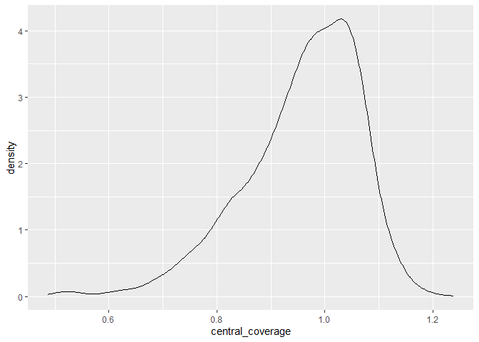<!-- -->

``` r
ggqqplot(b1_cov %>% dplyr::select(central_coverage), x = "central_coverage")
```

    ## Warning: The following aesthetics were dropped during statistical transformation: sample
    ## ℹ This can happen when ggplot fails to infer the correct grouping structure in
    ##   the data.
    ## ℹ Did you forget to specify a `group` aesthetic or to convert a numerical
    ##   variable into a factor?
    ## The following aesthetics were dropped during statistical transformation: sample
    ## ℹ This can happen when ggplot fails to infer the correct grouping structure in
    ##   the data.
    ## ℹ Did you forget to specify a `group` aesthetic or to convert a numerical
    ##   variable into a factor?

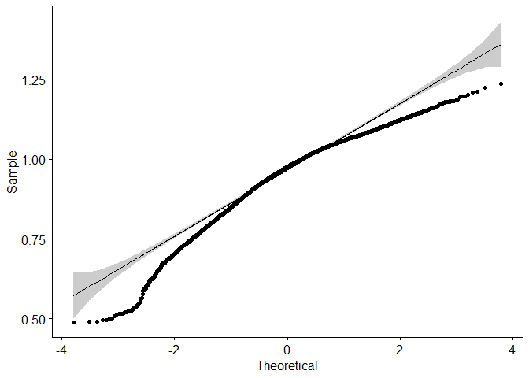<!-- -->

``` r
b2_cov %>% dplyr::select(central_coverage) %>% ggplot(aes(x = central_coverage)) + geom_histogram()
```

    ## `stat_bin()` using `bins = 30`. Pick better value with `binwidth`.

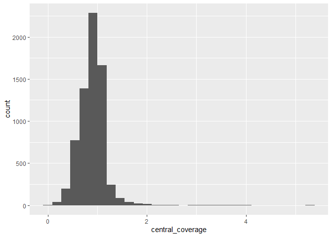<!-- -->

``` r
ggqqplot(b2_cov %>% dplyr::select(central_coverage), x = "central_coverage")
```

    ## Warning: The following aesthetics were dropped during statistical transformation: sample
    ## ℹ This can happen when ggplot fails to infer the correct grouping structure in
    ##   the data.
    ## ℹ Did you forget to specify a `group` aesthetic or to convert a numerical
    ##   variable into a factor?
    ## The following aesthetics were dropped during statistical transformation: sample
    ## ℹ This can happen when ggplot fails to infer the correct grouping structure in
    ##   the data.
    ## ℹ Did you forget to specify a `group` aesthetic or to convert a numerical
    ##   variable into a factor?

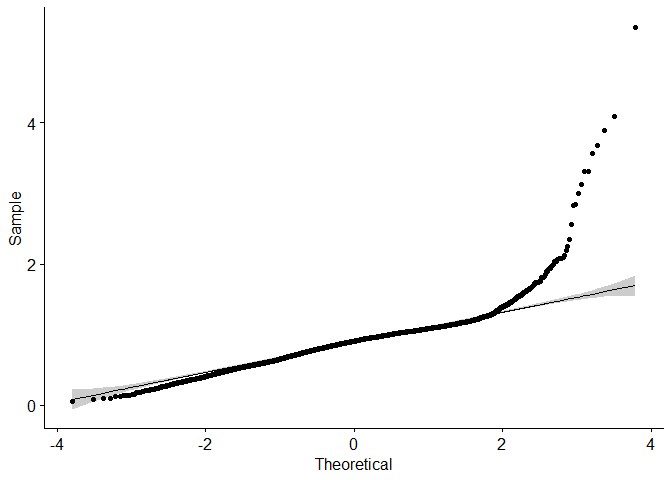<!-- -->

``` r
b3_cov %>% dplyr::select(central_coverage) %>% ggplot(aes(x = central_coverage)) + geom_histogram()
```

    ## `stat_bin()` using `bins = 30`. Pick better value with `binwidth`.

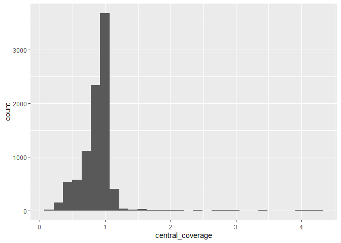<!-- -->

``` r
ggqqplot(b3_cov %>% dplyr::select(central_coverage), x = "central_coverage")
```

    ## Warning: The following aesthetics were dropped during statistical transformation: sample
    ## ℹ This can happen when ggplot fails to infer the correct grouping structure in
    ##   the data.
    ## ℹ Did you forget to specify a `group` aesthetic or to convert a numerical
    ##   variable into a factor?
    ## The following aesthetics were dropped during statistical transformation: sample
    ## ℹ This can happen when ggplot fails to infer the correct grouping structure in
    ##   the data.
    ## ℹ Did you forget to specify a `group` aesthetic or to convert a numerical
    ##   variable into a factor?

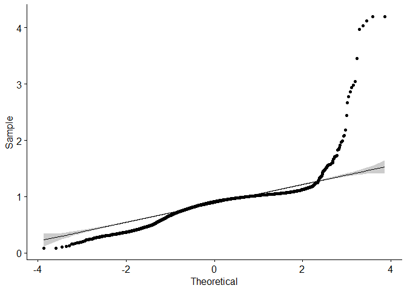<!-- -->

This data has been normalised during the Griffin process, and PCA
reviews have mentioned that gene expression analysis has been undertaken
with non-normal data.

# Transposing data for PCA

``` r
#transpose so rows are samples and columns are genes
b1_pca_mat <- b1_mat_ex %>%  t()
b2_pca_mat <- b2_mat_ex %>%  t()
b3_pca_mat <- b3_mat_ex %>%  t()

#use precomp function
b1_pca_data <- prcomp(b1_pca_mat, center = TRUE,scale. = TRUE)
b2_pca_data <- prcomp(b2_pca_mat, center = TRUE,scale. = TRUE)
b3_pca_data <- prcomp(b3_pca_mat, center = TRUE,scale. = TRUE)

# summary of pca object
summary(b1_pca_data)
```

    ## Importance of components:
    ##                            PC1     PC2     PC3     PC4     PC5     PC6     PC7
    ## Standard deviation     13.3826 3.42499 3.27836 3.04177 2.94765 2.74796 2.64407
    ## Proportion of Variance  0.6633 0.04345 0.03981 0.03427 0.03218 0.02797 0.02589
    ## Cumulative Proportion   0.6633 0.70676 0.74656 0.78083 0.81301 0.84098 0.86687
    ##                            PC8     PC9    PC10   PC11    PC12    PC13    PC14
    ## Standard deviation     2.60590 2.56505 2.33405 2.2887 2.11914 1.98016 1.86457
    ## Proportion of Variance 0.02515 0.02437 0.02018 0.0194 0.01663 0.01452 0.01288
    ## Cumulative Proportion  0.89202 0.91639 0.93657 0.9560 0.97260 0.98712 1.00000
    ##                             PC15
    ## Standard deviation     2.743e-14
    ## Proportion of Variance 0.000e+00
    ## Cumulative Proportion  1.000e+00

``` r
summary(b2_pca_data)
```

    ## Importance of components:
    ##                            PC1    PC2     PC3     PC4     PC5     PC6    PC7
    ## Standard deviation     14.0671 6.5702 4.00414 2.99070 1.23999 0.97420 0.9001
    ## Proportion of Variance  0.7329 0.1599 0.05938 0.03313 0.00569 0.00352 0.0030
    ## Cumulative Proportion   0.7329 0.8928 0.95216 0.98529 0.99098 0.99450 0.9975
    ##                           PC8       PC9
    ## Standard deviation     0.8216 8.249e-15
    ## Proportion of Variance 0.0025 0.000e+00
    ## Cumulative Proportion  1.0000 1.000e+00

``` r
summary(b3_pca_data)
```

    ## Importance of components:
    ##                            PC1    PC2     PC3     PC4     PC5     PC6     PC7
    ## Standard deviation     12.9690 5.2156 4.40534 3.66752 3.08750 3.01293 2.92210
    ## Proportion of Variance  0.6229 0.1008 0.07188 0.04982 0.03531 0.03362 0.03162
    ## Cumulative Proportion   0.6229 0.7237 0.79557 0.84538 0.88069 0.91431 0.94594
    ##                            PC8     PC9      PC10
    ## Standard deviation     2.86242 2.53058 3.795e-14
    ## Proportion of Variance 0.03035 0.02372 0.000e+00
    ## Cumulative Proportion  0.97628 1.00000 1.000e+00

# Variance explained by PC

``` r
# PC variances using broom (eigen values)
b1_pc_eigenvalues <- tidy(b1_pca_data, matrix = "eigenvalues")
b2_pc_eigenvalues <- tidy(b2_pca_data, matrix = "eigenvalues")
b3_pc_eigenvalues <- tidy(b3_pca_data, matrix = "eigenvalues")

# print the result
b1_pc_eigenvalues
```

    ## # A tibble: 15 × 4
    ##       PC  std.dev percent cumulative
    ##    <dbl>    <dbl>   <dbl>      <dbl>
    ##  1     1 1.34e+ 1  0.663       0.663
    ##  2     2 3.42e+ 0  0.0434      0.707
    ##  3     3 3.28e+ 0  0.0398      0.747
    ##  4     4 3.04e+ 0  0.0343      0.781
    ##  5     5 2.95e+ 0  0.0322      0.813
    ##  6     6 2.75e+ 0  0.0280      0.841
    ##  7     7 2.64e+ 0  0.0259      0.867
    ##  8     8 2.61e+ 0  0.0252      0.892
    ##  9     9 2.57e+ 0  0.0244      0.916
    ## 10    10 2.33e+ 0  0.0202      0.937
    ## 11    11 2.29e+ 0  0.0194      0.956
    ## 12    12 2.12e+ 0  0.0166      0.973
    ## 13    13 1.98e+ 0  0.0145      0.987
    ## 14    14 1.86e+ 0  0.0129      1    
    ## 15    15 2.74e-14  0           1

``` r
# fraction of total variance of each PC
b1.pca_fra <- b1_pc_eigenvalues %>% 
  ggplot(aes(x = PC)) +
  geom_col(aes(y = percent)) +
  geom_line(aes(y = cumulative, group = 1)) + 
  geom_point(aes(y = cumulative)) +
  labs(x = "Principal component", y = "Fraction variance explained") +
  ggtitle("Batch 1")

b1.pca_fra
```

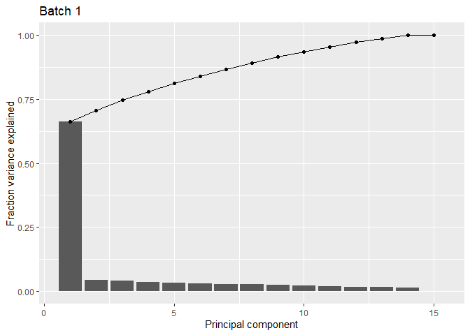<!-- -->

``` r
#ggsave("PCA_batch1-fractions_ofvariance.pdf")


b2.pca_fra <- b2_pc_eigenvalues %>% 
  ggplot(aes(x = PC)) +
  geom_col(aes(y = percent)) +
  geom_line(aes(y = cumulative, group = 1)) + 
  geom_point(aes(y = cumulative)) +
  labs(x = "Principal component", y = "Fraction variance explained") +
  ggtitle("Batch 2")

b2.pca_fra
```

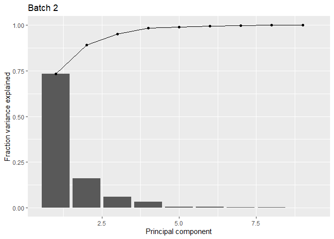<!-- -->

``` r
#ggsave("PCA_batch2-fractions_ofvariance.pdf")


b3.pca_fra <- b3_pc_eigenvalues %>% 
  ggplot(aes(x = PC)) +
  geom_col(aes(y = percent)) +
  geom_line(aes(y = cumulative, group = 1)) + 
  geom_point(aes(y = cumulative)) +
  labs(x = "Principal component", y = "Fraction variance explained") +
  ggtitle("Batch 3")

b3.pca_fra
```

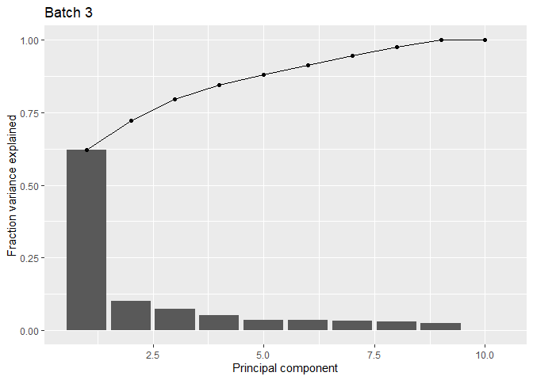<!-- -->

``` r
#ggsave("PCA_batch3-fractions_ofvariance.pdf")

(b1.pca_fra + b2.pca_fra + b3.pca_fra)
```

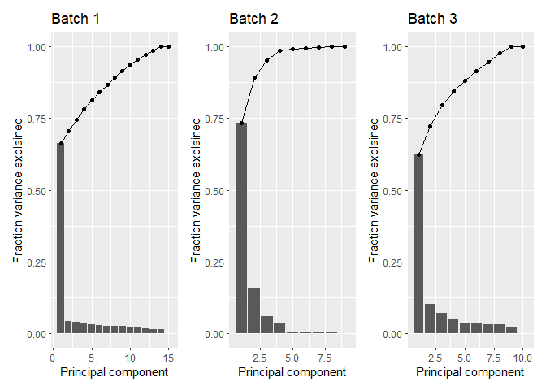<!-- -->

``` r
ggsave("final_figures/Figure_6_PCA_1-3_fracs_ofvariance.pdf", width = 8, height = 4)
```

# PCA with clinical annotation CAP-TRG

``` r
clinical_df_all
```

    ## # A tibble: 34 × 8
    ##    patient_id sample_id   Age Gender CAP_TRG pT       pN batch
    ##    <chr>      <chr>     <dbl> <chr>  <chr>   <chr> <dbl> <fct>
    ##  1 10         10A          62 Female Unknown <NA>     NA 1    
    ##  2 11         11A          64 Male   2       T3        1 1    
    ##  3 14         14A          71 Male   0       <NA>     NA 1    
    ##  4 17         17A          67 Male   3       ypT3      2 1    
    ##  5 18         18A          64 Male   1       ypT1      0 1    
    ##  6 19         19A          56 Male   Unknown <NA>     NA 1    
    ##  7 80         80A          56 Male   0       T0        0 1    
    ##  8 81         81A          57 Male   3       T2        0 1    
    ##  9 82         82A          75 Male   0       T0        2 1    
    ## 10 83         83A          45 Male   3       T3        1 1    
    ## # … with 24 more rows

``` r
# batch 1
b1_pca_data$x %>% # extract the loadings from prcomp
  # convert to a tibble retaining the sample names as a new column
  as_tibble(rownames = "sample_id") %>% 
  # join with "sample_info" table 
  full_join(clinical_df_all, by = "sample_id") %>% 
  # create the plot
  ggplot(aes(x = PC1, y = PC2, colour = factor(CAP_TRG))) +
  geom_point()
```

    ## Warning: Removed 19 rows containing missing values (`geom_point()`).

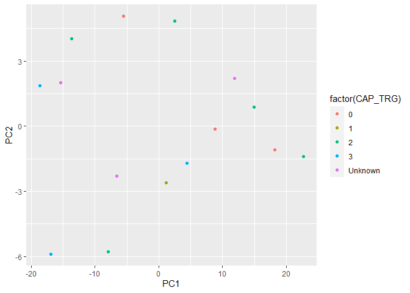<!-- -->

``` r
pca_cap.1 <- autoplot(b1_pca_data, data = clinical_df_all %>% filter(batch == 1), colour = "CAP_TRG") +
  geom_text(aes(label = sample_id), vjust = "inward",hjust="inward", size = 2, check_overlap = FALSE) + theme_bw() + ggtitle("Batch 1")

pca_cap.2 <- autoplot(b2_pca_data, data = clinical_df_all %>% filter(batch == 2), colour = "CAP_TRG") +
  geom_text(aes(label = sample_id), vjust ="inward",hjust ="inward", size = 2, check_overlap = FALSE) + theme_bw() + ggtitle("Batch 2")

pca_cap.3 <- autoplot(b3_pca_data, data = clinical_df_all %>% filter(batch == 3), colour = "CAP_TRG") +
  geom_text(aes(label = sample_id), vjust = "inward",hjust="inward", size = 2, check_overlap = FALSE) + theme_bw() + ggtitle("Batch 3")
```

# TF loadings

``` r
# exploring the correlation between gene

b1_pc_loadings <- b1_pca_data$rotation
b2_pc_loadings <- b2_pca_data$rotation
b3_pc_loadings <- b3_pca_data$rotation

#convert matrix to dataframe
b1_pc_loadings <- b1_pc_loadings %>% 
  as_tibble(rownames = "gene")


#convert matrix to dataframe
b2_pc_loadings <- b2_pc_loadings %>% 
  as_tibble(rownames = "gene")

#convert matrix to dataframe
b3_pc_loadings <- b3_pc_loadings %>% 
  as_tibble(rownames = "gene")

# print the result
b1_pc_loadings
```

    ## # A tibble: 270 × 16
    ##    gene        PC1      PC2      PC3     PC4      PC5      PC6      PC7      PC8
    ##    <chr>     <dbl>    <dbl>    <dbl>   <dbl>    <dbl>    <dbl>    <dbl>    <dbl>
    ##  1 SOX5    -0.0666  0.0277   0.0298   0.0196  0.0987   0.0488   0.0414   0.0112 
    ##  2 AHR     -0.0663  0.00256  0.00997  0.0172  0.0238  -0.104    0.00102 -0.0267 
    ##  3 HMG20A  -0.0683 -0.0124  -0.0222  -0.0148  0.0861   0.0150  -0.0796  -0.0488 
    ##  4 CEBPA   -0.0572 -0.0502  -0.0402   0.0922  0.00723  0.0622   0.00267 -0.154  
    ##  5 NR4A1   -0.0674  0.0350  -0.0241  -0.0592 -0.0555   0.0678  -0.0793  -0.0115 
    ##  6 HNF4G   -0.0695 -0.00774  0.0376  -0.0583  0.0447   0.00963  0.0127   0.0185 
    ##  7 ZBTB2   -0.0730  0.0380   0.0248  -0.0110 -0.0251   0.0245  -0.0328   0.0205 
    ##  8 PRDM9   -0.0588 -0.00799 -0.0807  -0.0199 -0.123    0.108    0.0292   0.0606 
    ##  9 NEUROD1 -0.0595 -0.0507   0.0166  -0.0636  0.0117  -0.0556  -0.0304  -0.117  
    ## 10 TEAD1   -0.0687 -0.0498  -0.00976  0.0444  0.0236  -0.0350  -0.106   -0.00968
    ## # … with 260 more rows, and 7 more variables: PC9 <dbl>, PC10 <dbl>,
    ## #   PC11 <dbl>, PC12 <dbl>, PC13 <dbl>, PC14 <dbl>, PC15 <dbl>

``` r
b2_pc_loadings
```

    ## # A tibble: 270 × 10
    ##    gene       PC1      PC2      PC3      PC4      PC5      PC6      PC7      PC8
    ##    <chr>    <dbl>    <dbl>    <dbl>    <dbl>    <dbl>    <dbl>    <dbl>    <dbl>
    ##  1 SOX5   -0.0701  0.0180  -0.00955 -2.94e-2  0.0435  -1.09e-2  0.0439  -0.00673
    ##  2 AHR    -0.0668 -0.0308  -0.0577   4.87e-2  0.00882  1.99e-2 -0.0110   0.0352 
    ##  3 HMG20A -0.0699  0.0135  -0.0159  -4.25e-2  0.0233   4.65e-4  0.0443   0.0774 
    ##  4 CEBPA  -0.0703  0.0156   0.00620 -2.61e-4  0.0846   1.09e-2  0.0151  -0.00558
    ##  5 NR4A1  -0.0695  0.0218   0.0359   4.14e-4  0.0382   2.76e-2  0.0330  -0.0280 
    ##  6 HNF4G  -0.0700  0.0226  -0.00366 -1.86e-2  0.0396  -4.97e-2  0.0175  -0.0166 
    ##  7 ZBTB2  -0.0644 -0.0387   0.0778   1.65e-2 -0.0656   8.01e-2 -0.0209   0.0342 
    ##  8 PRDM9  -0.0511 -0.0881  -0.0866  -4.26e-3 -0.0323  -8.80e-3  0.180    0.00783
    ##  9 NEURO… -0.0681  0.00266  0.0278  -7.34e-2  0.0481   1.13e-1 -0.0668   0.0411 
    ## 10 TEAD1  -0.0705  0.00442 -0.0177  -7.87e-3  0.0319   7.76e-2 -0.00242  0.0570 
    ## # … with 260 more rows, and 1 more variable: PC9 <dbl>

``` r
b3_pc_loadings
```

    ## # A tibble: 270 × 11
    ##    gene       PC1      PC2      PC3      PC4      PC5      PC6      PC7      PC8
    ##    <chr>    <dbl>    <dbl>    <dbl>    <dbl>    <dbl>    <dbl>    <dbl>    <dbl>
    ##  1 SOX5   -0.0694  0.0408  -0.00171 -0.0103   0.0556  -0.103    0.0433   0.0160 
    ##  2 AHR    -0.0693 -0.0205   0.0103   0.0468   0.0575  -0.0102  -0.0727  -0.0214 
    ##  3 HMG20A -0.0709  0.0385  -0.0470   0.0490   0.00592 -0.0362  -0.0220  -0.00137
    ##  4 CEBPA  -0.0589  0.107   -0.0465   0.0218  -0.0521   0.0506  -0.00644 -0.00210
    ##  5 NR4A1  -0.0628  0.0801   0.0248   0.0449  -0.0930  -0.00861  0.0623   0.0136 
    ##  6 HNF4G  -0.0552 -0.00278 -0.0618  -0.0576   0.125   -0.0863   0.0682   0.0514 
    ##  7 ZBTB2  -0.0619 -0.0634  -0.0120  -0.107   -0.0655  -0.0605  -0.0373  -0.0104 
    ##  8 PRDM9  -0.0515  0.0151  -0.0721  -0.0780   0.126    0.0768   0.125    0.0541 
    ##  9 NEURO… -0.0567  0.0786   0.0352  -0.115   -0.0217   0.0425   0.0528   0.00911
    ## 10 TEAD1  -0.0538 -0.0426  -0.0455   0.00614 -0.00819 -0.200    0.0110   0.0627 
    ## # … with 260 more rows, and 2 more variables: PC9 <dbl>, PC10 <dbl>

``` r
#batch1 
# select the top 10 genes
b1_top_genes <- b1_pc_loadings %>% 
  # select only the PCs we are interested in
  dplyr::select(gene, PC1, PC2) %>%
  # convert to a "long" format
  pivot_longer(matches("PC"), names_to = "PC", values_to = "loading") %>% 
  # for each PC
  group_by(PC) %>% 
  # arrange by descending order of loading
  dplyr::arrange(desc(abs(loading))) %>% 
  # take the 10 top rows
  dplyr::slice(1:10) %>% 
  # pull the gene column as a vector
  pull(gene) %>% 
  # ensure only unique genes are retained
  unique()

b1_top_genes
```

    ##  [1] "FOXM1"   "SRF"     "ZBTB2"   "SMAD4"   "CTCF"    "MAX"     "TFAP4"  
    ##  [8] "FLI1"    "RXRA"    "TEAD3"   "GATA4"   "OTX2"    "PRDM6"   "DUX4"   
    ## [15] "ATF4"    "HOXA9"   "ATF7"    "ZSCAN16" "ATF2"    "GATA3"

``` r
#batch 2
# select the top 10 genes
b2_top_genes <- b2_pc_loadings %>% 
  # select only the PCs we are interested in
  dplyr::select(gene, PC1, PC2) %>%
  # convert to a "long" format
  pivot_longer(matches("PC"), names_to = "PC", values_to = "loading") %>% 
  # for each PC
  group_by(PC) %>% 
  # arrange by descending order of loading
  dplyr::arrange(desc(abs(loading))) %>% 
  # take the 10 top rows
  dplyr::slice(1:10) %>% 
  # pull the gene column as a vector
  pull(gene) %>% 
  # ensure only unique genes are retained
  unique()

b2_top_genes
```

    ##  [1] "PPARG"  "RELB"   "FOS"    "JUND"   "SMAD1"  "CEBPD"  "TBX21"  "TAL1"  
    ##  [9] "NFKB2"  "NFKB1"  "PAX5"   "EGR3"   "EGR2"   "HIF3A"  "KLF1"   "TBP"   
    ## [17] "ZBTB26" "SP4"    "GLIS1"  "E2F4"

``` r
#batch 2
# select the top 10 genes
b3_top_genes <- b3_pc_loadings %>% 
  # select only the PCs we are interested in
  dplyr::select(gene, PC1, PC2) %>%
  # convert to a "long" format
  pivot_longer(matches("PC"), names_to = "PC", values_to = "loading") %>% 
  # for each PC
  group_by(PC) %>% 
  # arrange by descending order of loading
  dplyr::arrange(desc(abs(loading))) %>% 
  # take the 10 top rows
  dplyr::slice(1:10) %>% 
  # pull the gene column as a vector
  pull(gene) %>% 
  # ensure only unique genes are retained
  unique()

b3_top_genes
```

    ##  [1] "ETV5"    "PROX1"   "RXRA"    "VDR"     "SP1"     "FOXM1"   "RARA"   
    ##  [8] "ZNF580"  "STAT3"   "TRPS1"   "OTX2"    "ZNF121"  "ZNF770"  "SPI1"   
    ## [15] "WT1"     "ONECUT2" "NKX3-1"  "ZBTB16"  "ZNF449"  "ZBTB7A"

``` r
pca_gene_sum <- bind_cols(batch1 = sort(b1_top_genes), batch2 = sort(b2_top_genes), batch3 = sort(b3_top_genes))


# filter the top 10 genes 
b1_top_loadings <- b1_pc_loadings %>% 
  filter(gene %in% b1_top_genes)

# filter the top 10 genes 
b2_top_loadings <- b2_pc_loadings %>% 
  filter(gene %in% b2_top_genes)


# filter the top 10 genes 
b3_top_loadings <- b3_pc_loadings %>% 
  filter(gene %in% b3_top_genes)
```

## plot loadings

``` r
# batch 1 - top loading
b1_load.plot <- ggplot(data = b1_top_loadings) +
  geom_segment(aes(x = 0, y = 0, xend = PC1, yend = PC2), 
               arrow = arrow(length = unit(0.1, "in")),
               colour = "cadetblue") +
geom_text(aes(x = PC1, y = PC2, label = gene),
          position = position_jitter(width = 0.008, height = 0.005),
          size = 2) +
  scale_x_continuous(expand = c(0.02, 0.02)) +
  ggtitle("TF loadings") +
  xlab("PC1") + ylab("PC2")

b1_load.plot
```

<!-- -->

``` r
#ggsave("PCA_batch1_correlation_top10_genes.pdf")

#batch 2 - top loading
b2_load.plot <- ggplot(data = b2_top_loadings) +
  geom_segment(aes(x = 0, y = 0, xend = PC1, yend = PC2), 
               arrow = arrow(length = unit(0.1, "in")),
               colour = "cadetblue") +
  geom_text(aes(x = PC1, y = PC2, label = gene),
            position = position_jitter(width = 0.008, height = 0.005),
            size = 2) +
  scale_x_continuous(expand = c(0.02, 0.02)) +
  ggtitle("TF loadings") +
  xlab("PC1") + ylab("PC2")

b2_load.plot
```

<!-- -->

``` r
# ggsave("PCA_batch2_correlation_top10_genes.pdf")


b3_load.plot <- ggplot(data = b3_top_loadings) +
  geom_segment(aes(x = 0, y = 0, xend = PC1, yend = PC2), 
               arrow = arrow(length = unit(0.1, "in")),
               colour = "cadetblue") +
  geom_text(aes(x = PC1, y = PC2, label = gene),
            position = position_jitter(width = 0.008, height = 0.005),
            size = 2) +
  scale_x_continuous(expand = c(0.02, 0.02)) +
  ggtitle("TF loadings") +
  xlab("PC1") + ylab("PC2")

b3_load.plot
```

<!-- -->

``` r
#patch work summary of plots
(pca_cap.1/pca_cap.2 /pca_cap.3) + plot_annotation(title = "PCA analysis and Transcription factor loading ", tag_levels = "A")
```

<!-- -->

``` r
ggsave("final_figures/Figure_6_PCA_batch1-3_Samples_and_cap_trg_v2.pdf",width = 6, height = 6)


(pca_cap.1/pca_cap.2 /pca_cap.3)
```

<!-- -->

``` r
# laodings plot  
   (b1_load.plot/ b2_load.plot/ b3_load.plot) + plot_annotation(tag_levels = "A")
```

<!-- -->

``` r
ggsave("final_figures/Figure_6_PCA_batch1-3_LOAD_Samples_and_cap_trg_v2.pdf",width = 8, height = 8)
```

``` r
save.image(file = "inputs/04_SupData_PCA_analysis.RData")
```

``` r
#sessionInfo()
installed.packages()[names(sessionInfo()$otherPkgs), "Version"]
```

    ##     broom patchwork gridExtra    ggpubr  devtools   usethis ggfortify  ggbiplot 
    ##   "1.0.1"   "1.1.2"     "2.3"   "0.4.0"   "2.4.5"   "2.1.6"  "0.4.16"    "0.55" 
    ##    scales      plyr   forcats   stringr     dplyr     purrr     readr     tidyr 
    ##   "1.2.1"   "1.8.8"   "0.5.2"   "1.4.1"  "1.0.10"   "0.3.5"   "2.1.3"   "1.2.1" 
    ##    tibble tidyverse  PCAtools   ggrepel   ggplot2 
    ##   "3.1.8"   "1.3.2"  "2.10.0"   "0.9.2"   "3.4.0"
