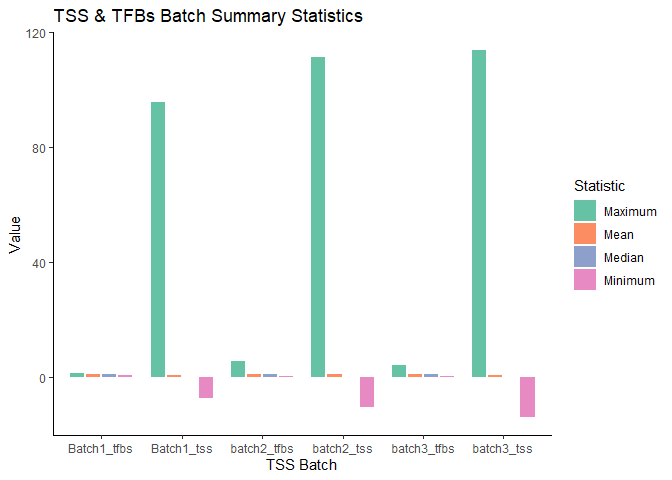

07_Supplementary_TSS_analysis
================
Glen Roarke
2023-08-10

``` r
install.packages("circlize")
install.packages("vroom")
install.packages("tidyverse")
install.packages("ggplot2")
install.packages("stringr")
install.packages("ComplexHeatmap")
install.packages("GetoptLong")
install.packages("circlize")
```

``` r
knitr::opts_chunk$set(echo = TRUE)

library(circlize)
library("vroom")
library("tidyverse")
library("ggplot2")
library("stringr")
library("ComplexHeatmap")
library(GetoptLong)
library(circlize)
```

# Import data

``` r
#import giffin gc corrected coverage data
tss_b1_cov = vroom("inputs/TSS_batch1_CRC_driv_Griffin GC_corrected.coverage_2023-07-06_13-48-08.csv")
```

    ## New names:
    ## Rows: 29850 Columns: 352
    ## ── Column specification
    ## ──────────────────────────────────────────────────────── Delimiter: "," chr
    ## (6): correction, site_name, sample, Chrom, Strand, sample_id dbl (342): ...1,
    ## -2490, -2475, -2460, -2445, -2430, -2415, -2400, -2385, -23... lgl (4):
    ## outlier_cutoff, exclude_zero_mappability, smoothing, CNA_normaliz...
    ## ℹ Use `spec()` to retrieve the full column specification for this data. ℹ
    ## Specify the column types or set `show_col_types = FALSE` to quiet this message.
    ## • `` -> `...1`

``` r
tss_b2_cov = vroom("inputs/TSS_batch2_CRC_Griffin_GC_corrected.coverage_2023-07-12_16-11-56.csv")
```

    ## New names:
    ## Rows: 29850 Columns: 352
    ## ── Column specification
    ## ──────────────────────────────────────────────────────── Delimiter: "," chr
    ## (6): correction, site_name, sample, Chrom, Strand, sample_id dbl (342): ...1,
    ## -2490, -2475, -2460, -2445, -2430, -2415, -2400, -2385, -23... lgl (4):
    ## outlier_cutoff, exclude_zero_mappability, smoothing, CNA_normaliz...
    ## ℹ Use `spec()` to retrieve the full column specification for this data. ℹ
    ## Specify the column types or set `show_col_types = FALSE` to quiet this message.
    ## • `` -> `...1`

``` r
tss_b3_cov = vroom("inputs/TSS_batch3_CRC_Griffin_GC_corrected.coverage_2023-07-12_16-14-46.csv")
```

    ## New names:
    ## Rows: 39402 Columns: 352
    ## ── Column specification
    ## ──────────────────────────────────────────────────────── Delimiter: "," chr
    ## (6): correction, site_name, sample, Chrom, Strand, sample_id dbl (342): ...1,
    ## -2490, -2475, -2460, -2445, -2430, -2415, -2400, -2385, -23... lgl (4):
    ## outlier_cutoff, exclude_zero_mappability, smoothing, CNA_normaliz...
    ## ℹ Use `spec()` to retrieve the full column specification for this data. ℹ
    ## Specify the column types or set `show_col_types = FALSE` to quiet this message.
    ## • `` -> `...1`

``` r
#clean gene name
tss_b1_cov$site_name <- str_remove(tss_b1_cov$site_name, "\\..*")
tss_b2_cov$site_name <- str_remove(tss_b2_cov$site_name, "\\..*")
tss_b3_cov$site_name <- str_remove(tss_b3_cov$site_name, "\\..*")


#add batch number
tss_b1_cov$batch <- as.factor(1)
tss_b2_cov$batch <- as.factor(2)
tss_b3_cov$batch <- as.factor(3)
```

``` r
# Create the sequence of columns for selection - larger window
tss_win_plot_columns <- seq(-2490, 2475, 15)
tss_str_plot_columns <- as.character(tss_win_plot_columns)

# transpose and pivot all three batches

#batch 1
tss_b1_cov_T <- tss_b1_cov %>% 
  dplyr::select(sample_id, site_name, batch, all_of(tss_str_plot_columns)) %>% 
  tidyr::pivot_longer(cols = tss_str_plot_columns, names_to = "distance", values_to = "coverage") %>% 
  mutate(distance = as.numeric(distance))
```

    ## Warning: Using an external vector in selections was deprecated in tidyselect 1.1.0.
    ## ℹ Please use `all_of()` or `any_of()` instead.
    ##   # Was:
    ##   data %>% select(tss_str_plot_columns)
    ## 
    ##   # Now:
    ##   data %>% select(all_of(tss_str_plot_columns))
    ## 
    ## See <https://tidyselect.r-lib.org/reference/faq-external-vector.html>.

``` r
#batch 2
tss_b2_cov_T <- tss_b2_cov %>% 
  dplyr::select(sample_id, site_name, batch, all_of(tss_str_plot_columns)) %>% 
  tidyr::pivot_longer(cols = tss_str_plot_columns, names_to = "distance", values_to = "coverage") %>% 
  mutate(distance = as.numeric(distance))

#batch 3
tss_b3_cov_T <- tss_b3_cov %>% 
  dplyr::select(sample_id, site_name, batch, all_of(tss_str_plot_columns)) %>% 
  tidyr::pivot_longer(cols = tss_str_plot_columns, names_to = "distance", values_to = "coverage") %>% 
  mutate(distance = as.numeric(distance))

summary(tss_b1_cov_T$coverage)
```

    ##    Min. 1st Qu.  Median    Mean 3rd Qu.    Max.    NA's 
    ##   -55.9     0.0     0.0     0.9     0.0   138.2  696403

``` r
summary(tss_b2_cov_T$coverage)
```

    ##    Min. 1st Qu.  Median    Mean 3rd Qu.    Max.    NA's 
    ##  -458.5     0.0     0.0     1.0     0.9   459.7  716951

``` r
summary(tss_b3_cov_T$coverage)
```

    ##    Min. 1st Qu.  Median    Mean 3rd Qu.    Max.    NA's 
    ##  -372.2     0.0     0.0     0.9     0.4   183.0  922330

# Create heatmaps

This section creates heatmaps and annotations.

``` r
#create annotations for each batch

# load in preprocessing stats
load("inputs/HQ_data.RData")

#create annotation data frames to check order
b1_ann <- b1_preproc %>% dplyr::select(sample_id, Mapped_read_pairs)
b2_ann <- b2_preproc %>% dplyr::select(sample_id, Mapped_read_pairs)
b3_ann <- b3_preproc %>% dplyr::select(sample_id, Mapped_read_pairs)


#create annotations for each batch
b1_ha_bot = HeatmapAnnotation(read_mapping = anno_barplot(round(b1_ann$Mapped_read_pairs,2)
                                                          ,add_numbers = TRUE)
                              ,height = unit(2, "cm"))


b2_ha_bot = HeatmapAnnotation(read_mapping = anno_barplot(round(b2_ann$Mapped_read_pairs,2)
                                                          ,add_numbers = TRUE)
                              ,height = unit(2, "cm"))

b3_ha_bot = HeatmapAnnotation(read_mapping = anno_barplot(round(b3_ann$Mapped_read_pairs,2)
                                                          ,add_numbers = TRUE)
                              ,height = unit(2, "cm"))
```

``` r
# heatmap of all TSS sites run through griffin

# batch1
tss_b1_mat <- tss_b1_cov %>% 
  dplyr::select(site_name, sample_id, central_coverage) %>% 
  arrange(sample_id) %>% 
  drop_na(central_coverage) %>% 
  pivot_wider(names_from = sample_id, values_from = central_coverage) %>% 
  column_to_rownames(var = "site_name") %>% 
  as.matrix()

#filter out rows with all zeros and any na values
tss_b1_mat <- tss_b1_mat[rowSums(tss_b1_mat != 0) > 0, ]
tss_b1_mat <- tss_b1_mat[!rowSums(is.na(tss_b1_mat)),]


# batch 2
tss_b2_mat <- tss_b2_cov %>% 
  dplyr::select(site_name, sample_id, central_coverage) %>%
  arrange(sample_id) %>% 
  drop_na(central_coverage) %>% 
  pivot_wider(names_from = sample_id, values_from = central_coverage) %>% 
  column_to_rownames(var = "site_name") %>% 
  as.matrix()

#filter out rows with all zeros and any na values
tss_b2_mat <- tss_b2_mat[rowSums(tss_b2_mat != 0) > 0, ]
tss_b2_mat <- tss_b2_mat[!rowSums(is.na(tss_b2_mat)),]


# batch 
tss_b3_mat <- tss_b3_cov %>% 
  dplyr::select(site_name, sample_id, central_coverage) %>% 
  arrange(sample_id) %>% 
  drop_na(central_coverage) %>% 
  pivot_wider(names_from = sample_id, values_from = central_coverage) %>% 
  column_to_rownames(var = "site_name") %>% 
  as.matrix()

#filter out rows with all zeros and any na values
tss_b3_mat <- tss_b3_mat[rowSums(tss_b3_mat != 0) > 0, ]
tss_b3_mat <- tss_b3_mat[!rowSums(is.na(tss_b3_mat)),]


col_fun = colorRamp2(c(-20, 0, 20), c("blue", "white", "red"))
col_fun(seq(-3, 3))
```

    ## [1] "#EBDCFFFF" "#F2E7FFFF" "#F8F3FFFF" "#FFFFFFFF" "#FFF5F2FF" "#FFECE5FF"
    ## [7] "#FFE2D8FF"

``` r
ht_tss_b1 <-Heatmap(tss_b1_mat, name = "Batch1_TSS_clustering"
        , col = col_fun
        , column_title = qq("Batch 1 - TSS promoter analysis of @{nrow(tss_b1_mat)} genes, n = (@{ncol(tss_b1_mat)})")
        ,bottom_annotation = b1_ha_bot
        , na_col = "black")


ht_tss_b2 <-Heatmap(tss_b2_mat, name = "bacth2_TSS_clustering"
                    , col = col_fun
                    , column_title = qq("Batch 2 - TSS promoter analysis of @{nrow(tss_b2_mat)} genes, n = (@{ncol(tss_b2_mat)})")
                    , bottom_annotation = b2_ha_bot
                    , na_col = "black")


ht_tss_b3 <-Heatmap(tss_b3_mat, name = "batch3_TSS_clustering"
                    , col = col_fun
                    , column_title = qq("Batch 3 - TSS promoter analysis of @{nrow(tss_b3_mat)} genes, n = (@{ncol(tss_b3_mat)})")
                    , bottom_annotation = b3_ha_bot
                    , na_col = "black")

#### gene labels ####

#set 1 in every nth row value
row_d = 70

#each heatmap requires its own label because rows are different
#batch 1 gene label 
b1_genelabels <- rowAnnotation(
  Genes = anno_mark(
    at = seq(1, nrow(tss_b1_mat), row_d),
    labels = rownames(tss_b1_mat)[seq(1, nrow(tss_b1_mat), row_d)],
    labels_gp = gpar(fontsize = 10, fontface = 'bold'),
    padding = 0.5),
  width = unit(2.0, 'cm') +
    
    max_text_width(
      rownames(tss_b1_mat)[seq(1, nrow(tss_b1_mat), row_d)],
      gp = gpar(fontsize = 10,  fontface = 'bold')))

#batch 2 gene label 
b2_genelabels <- rowAnnotation(
  Genes = anno_mark(
    at = seq(1, nrow(tss_b2_mat), row_d),
    labels = rownames(tss_b2_mat)[seq(1, nrow(tss_b2_mat), row_d)],
    labels_gp = gpar(fontsize = 10, fontface = 'bold'),
    padding = 0.5),
  width = unit(2.0, 'cm') +
    
    max_text_width(
      rownames(tss_b2_mat)[seq(1, nrow(tss_b2_mat), row_d)],
      gp = gpar(fontsize = 10,  fontface = 'bold')))


#batch 3 gene label 
b3_genelabels <- rowAnnotation(
  Genes = anno_mark(
    at = seq(1, nrow(tss_b3_mat), row_d),
    labels = rownames(tss_b3_mat)[seq(1, nrow(tss_b3_mat), row_d)],
    labels_gp = gpar(fontsize = 10, fontface = 'bold'),
    padding = 0.5),
  width = unit(2.0, 'cm') +
    
    max_text_width(
      rownames(tss_b3_mat)[seq(1, nrow(tss_b3_mat), row_d)],
      gp = gpar(fontsize = 10,  fontface = 'bold')))
```

``` r
# save figures to pdf

pdf(file = "final_figures/Figure_9-batch1_TSS_central_coverage_CRC_drivers.pdf",width = 8, height = 4) # height and width in inches
draw(ht_tss_b1 + b1_genelabels)
# Step 3: Run dev.off() to create the file!
dev.off()
```

    ## png 
    ##   2

``` r
pdf(file = "final_figures/Figure_-9-batch2_TSS_central_coverage_CRC_drivers.pdf",width = 8, height = 4) # height and width in inches
draw(ht_tss_b2 + b2_genelabels)
dev.off()
```

    ## png 
    ##   2

``` r
pdf(file = "final_figures/Figure_9-batch3_TSS_central_coverage_CRC_drivers.pdf",width = 8, height = 4) # height and width in inches
draw(ht_tss_b3 + b3_genelabels)
dev.off()
```

    ## png 
    ##   2


``` r
# significant variance in TSS config why?

# Assuming you have three matrices: tss_b1_mat, tss_b2_mat, and tss_b3_mat
# Load the tibble package
library(tibble)

# Create a summary tibble
summary_tss <- tibble(
  TSS_batch = c("Batch1_tss", "batch2_tss", "batch3_tss"),
  Minimum = c(min(tss_b1_mat), min(tss_b2_mat), min(tss_b3_mat)),
  Mean = c(mean(tss_b1_mat), mean(tss_b2_mat), mean(tss_b3_mat)),
  Median = c(median(tss_b1_mat), median(tss_b2_mat), median(tss_b3_mat)),
  Maximum = c(max(tss_b1_mat), max(tss_b2_mat), max(tss_b3_mat)))
  
load("02_Sup_all_coverage.Rdata")
summary_tfbs <- tibble(
  TSS_batch = c("Batch1_tfbs", "batch2_tfbs", "batch3_tfbs"),
  Minimum = c(min(b1_mat), min(b2_mat), min(b3_mat)),
  Mean = c(mean(b1_mat), mean(b2_mat), mean(b3_mat)),
  Median = c(median(b1_mat), median(b2_mat), median(b3_mat)),
  Maximum = c(max(b1_mat), max(b2_mat), max(b3_mat)))

vroom_write(summary_tss, "TSS_statistics.csv", delim = ",")
```

``` r
summary_long <- gather(summary_tss, Statistic, Value, -TSS_batch)

summary_long.1 <- gather(bind_rows(summary_tss,summary_tfbs), Statistic, Value, -TSS_batch)


# Create the grouped bar plot
ggplot(summary_long.1, aes(x = TSS_batch, y = Value, fill = Statistic)) +
  geom_bar(stat = "identity", position = position_dodge(width = 0.8), width = 0.7) +
  theme_classic() +
  labs(title = "TSS & TFBs Batch Summary Statistics",
       x = "TSS Batch",
       y = "Value",
       fill = "Statistic") +
  scale_fill_brewer(palette = "Set2")
```

<!-- -->

``` r
ggsave("final_figures/Figure_10_TSSvariance.pdf", height = 4, width = 6)
```

## TSS plots

``` r
# plotting tp53 

p53_fam <- c("TP53_1")
sample_list <- c("85A", "10A")
#This plot is to compare with experimental evidence
ggplot(tss_b1_cov_T %>% filter(site_name %in% p53_fam & sample_id %in% sample_list)
       ,aes(x = distance , y = coverage, col = sample_id)) + 
  geom_line() +
  facet_grid(~ sample_id) +
  scale_x_continuous(breaks = c(-2500, -1000, 0, 1000, 2500))  +
  theme_classic() +
  theme(legend.position = 'right') +
  ggtitle('Batch 1 - p53 TSS - Loci: Chr17 - 7,687,487bp') +
  xlab('Distance from site (kb)') +
  ylab('Normalised coverage')
```

<!-- -->

``` r
#geom_text(aes(label = distance), vjust = -1, size = 2, check_overlap = TRUE)

ggsave('final_figures/Figure_7_TP53_TSS.pdf' ,width = 7, height = 4)
```

# Save

``` r
save.image(file = "07_Sup_all_TSS_analysis.Rdata")
```

# SessionInfo

``` r
#sessionInfo()
installed.packages()[names(sessionInfo()$otherPkgs), "Version"]
```

    ##     GetoptLong ComplexHeatmap        forcats        stringr          dplyr 
    ##        "1.0.5"       "2.14.0"        "0.5.2"        "1.4.1"       "1.0.10" 
    ##          purrr          readr          tidyr         tibble        ggplot2 
    ##        "0.3.5"        "2.1.3"        "1.2.1"        "3.1.8"        "3.4.0" 
    ##      tidyverse          vroom       circlize 
    ##        "1.3.2"   "1.6.0.9000"       "0.4.15"
