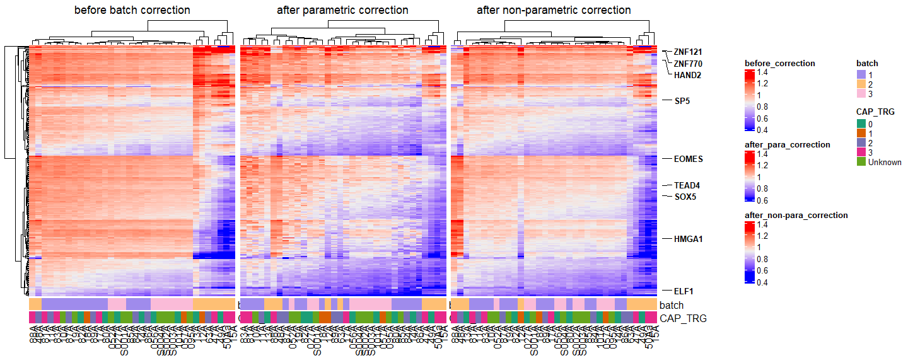

Supplementary 9 - Batch corrected heatmaps
================
Glen Roarke
2023-08-13

``` r
install.packages("vroom")
install.packages("tidyverse")
install.packages("ggplot2")
install.packages("patchwork")
```

``` r
knitr::opts_chunk$set(echo = TRUE)


library("vroom")
library("tidyverse")
library("ggplot2")
library("stringr")
library("ComplexHeatmap")
library(circlize)
library(GetoptLong)
library(RColorBrewer)
```

# load

``` r
# needed for the same sample filters, PCA analysis and Combat correction.

load("inputs/HQ_central_coverage_workspace.RData")

load("inputs/05_PCA_Correction.RData")
```

# High quality samples

``` r
#filter out samples
filter <- c(b1_filter,b2_filter, b3_filter)

#create annotations
batch_ann <- preproc_all.tm %>% dplyr::select(sample_id, batch) %>%  filter(sample_id %in% filter)
cap_trg_ann <- bind_rows(b1_cap_ann, b2_cap_ann ,b3_cap_ann)


#before correction
before_ht <- t(all_cov_mat.tm[filter,])

#after correction
after_ht <- t(cov.mat.combat[filter,])

#after non-parametric
after_non_para <- t(cov.mat.combat.2[filter,])

#create annotation
ha_ann_bot = HeatmapAnnotation(
  batch = batch_ann$batch,
  CAP_TRG = cap_trg_ann$CAP_TRG,
  col = list(CAP_TRG = structure(names = c("0", "1", "2", "3", "Unknown"), brewer.pal(5,"Dark2")))
  )
```

# Heatmap creation

``` r
# before batch correction
ht_before = Heatmap(before_ht
                   #, col = col_fun
                   , name = "before_correction"
                   #, clustering_distance_rows = "pearson"
                   , bottom_annotation = ha_ann_bot
                   , column_title = qq("before batch correction"))
```

    ## The automatically generated colors map from the 1^st and 99^th of the
    ## values in the matrix. There are outliers in the matrix whose patterns
    ## might be hidden by this color mapping. You can manually set the color
    ## to `col` argument.
    ## 
    ## Use `suppressMessages()` to turn off this message.

``` r
# before batch correction
ht_after_para = Heatmap(after_ht
                    #, col = col_fun
                    , name = "after_para_correction"
                    #, clustering_distance_rows = "pearson"
                    , bottom_annotation = ha_ann_bot
                    #,column_title = qq("Central coverage after parametric correction @{nrow(after_ht)} TFs, n = @{ncol(after_ht)}"))
                    , column_title = qq("after parametric correction"))
```

    ## The automatically generated colors map from the 1^st and 99^th of the
    ## values in the matrix. There are outliers in the matrix whose patterns
    ## might be hidden by this color mapping. You can manually set the color
    ## to `col` argument.
    ## 
    ## Use `suppressMessages()` to turn off this message.

``` r
# before batch correction
ht_after_non_para = Heatmap(after_non_para
                        #, col = col_fun
                        , name = "after_non-para_correction"
                        #, clustering_distance_rows = "pearson"
                        , bottom_annotation = ha_ann_bot
                        , column_title = qq("after non-parametric correction"))
```

    ## The automatically generated colors map from the 1^st and 99^th of the
    ## values in the matrix. There are outliers in the matrix whose patterns
    ## might be hidden by this color mapping. You can manually set the color
    ## to `col` argument.
    ## 
    ## Use `suppressMessages()` to turn off this message.

``` r
genelabels <- rowAnnotation(
  Genes = anno_mark(
    at = seq(1, nrow(b1_mat_ex_pt), row_num),
    labels = rownames(b1_mat_ex_pt)[seq(1, nrow(b1_mat_ex_pt), row_num)],
    labels_gp = gpar(fontsize = 10, fontface = 'bold'),
    padding = 0.75),
  width = unit(2.0, 'cm') +
    
    max_text_width(
      rownames(b1_mat_ex_pt)[seq(1, nrow(b1_mat_ex_pt), row_num)],
      gp = gpar(fontsize = 10,  fontface = 'bold')))
```

``` r
draw(ht_before + ht_after_para + ht_after_non_para + genelabels)
```

<!-- -->

``` r
pdf(file = "final_figures/Figure_6.3-batch_effect_correction.pdf",width = 11, height = 5) # height and width in inches
draw(ht_after_para + genelabels)
# Step 3: Run dev.off() to create the file!
dev.off()
```

    ## png 
    ##   2

``` r
pdf(file = "final_figures/Figure_6.3-batch_effect_non_para_correction.pdf",width = 11, height = 5) # height and width in inches
draw(ht_after_non_para + genelabels)
# Step 3: Run dev.off() to create the file!
dev.off()
```

    ## png 
    ##   2

``` r
pdf(file = "final_figures/Figure_10-batch_effect_correction.pdf",width = 15, height = 5) # height and width in inches
draw(ht_before + ht_after_para + ht_after_non_para + genelabels)
# Step 3: Run dev.off() to create the file!
dev.off()
```

    ## png 
    ##   2

# Save

``` r
save.image(file = "09_Sup_batch_corrected_heatmaps.Rdata")
```

``` r
#sessionInfo()
installed.packages()[names(sessionInfo()$otherPkgs), "Version"]
```

    ##   RColorBrewer     GetoptLong       circlize ComplexHeatmap        forcats 
    ##        "1.1-3"        "1.0.5"       "0.4.15"       "2.14.0"        "0.5.2" 
    ##        stringr          dplyr          purrr          readr          tidyr 
    ##        "1.4.1"       "1.0.10"        "0.3.5"        "2.1.3"        "1.2.1" 
    ##         tibble        ggplot2      tidyverse          vroom 
    ##        "3.1.8"        "3.4.0"        "1.3.2"   "1.6.0.9000"
